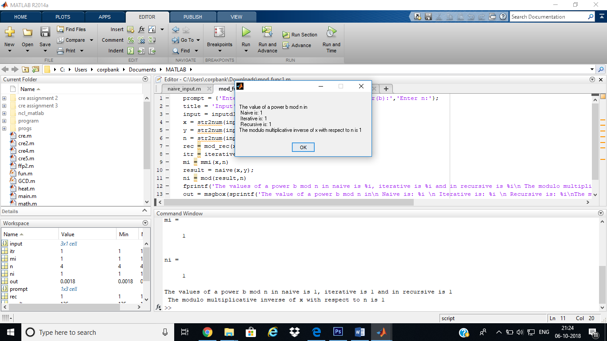
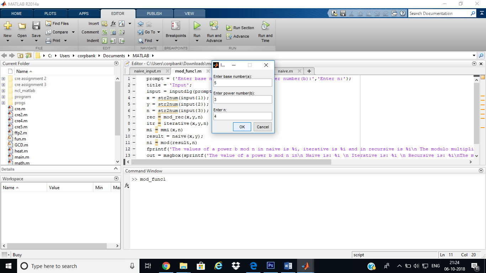

**Problem Statement**

Write a MATLAB code to perform modular exponentiation using the the
suitable algorithm. 
Given three numbers x, y and p, compute (x^y) % p.

**Members :**

1. Polkampally Keerthana         16CO131  keerthana.keetu.p@gmail.com  
2. Archana Priyadarshani Sahoo   16CO207  archana98priya@gmail.com

**Why to use Modular Exponentiation:** 
Sheer magnitude of large numbers causes the speed of calculations to slow considerably. As base and exponent increase even further to provide better security, the value be becomes unwieldy. Overflow may also happen in the direct calculation and hence Modular exponentiation is being used 

**Modular Exponentiation :**

Modular exponentiation is a type of exponentiation performed over a modulus. 
The operation of modular exponentiation calculates the remainder when an integer b (the base) raised to the eth power (the exponent), b^e, is divided by a positive integer m (the modulus). In symbols, given base b, exponent e, and modulus m, the modular exponentiation c is: c = b^e mod m. From the definition of c, it follows that 0 ≤ c < m.

**Approaches :**

1. Naive approach
2. Modular exponentiation method  
    a. Recursive Method 
    b. Iterative Method

**File structure**

main.m -> Main file which takes input.

1. **Naive Approach** 
   matlab code: naive.m  
   cpp code   : naive.cpp   
2. **Modular Exponentiation Recursive Method** 
   matlab code: mod_rec.m   
   cpp code   : mod_recursive.cpp
3. **Modular Exponentiation Iterative Method** 
   matlab code: iterative.m 
   cpp code   : iterative.cpp
4. **Modular Multiplicative Inverse** (Application of Modular Exponentiation) 
   matlab code: mmi.m
**Example :**

1. Modular Exponentation :  
   base (a) = 5 
   power(b) = 3 
   n = 3  
   	The value of (a^b) mod n = (5^3) mod 3 = 2.
    
**Screenshots of the Results:**
  
  
  
